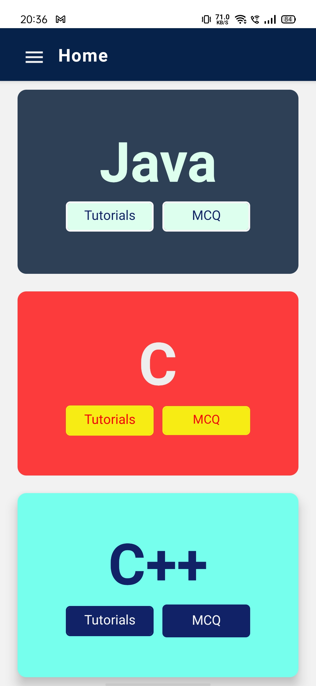
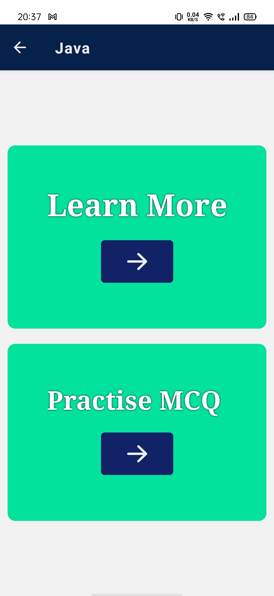
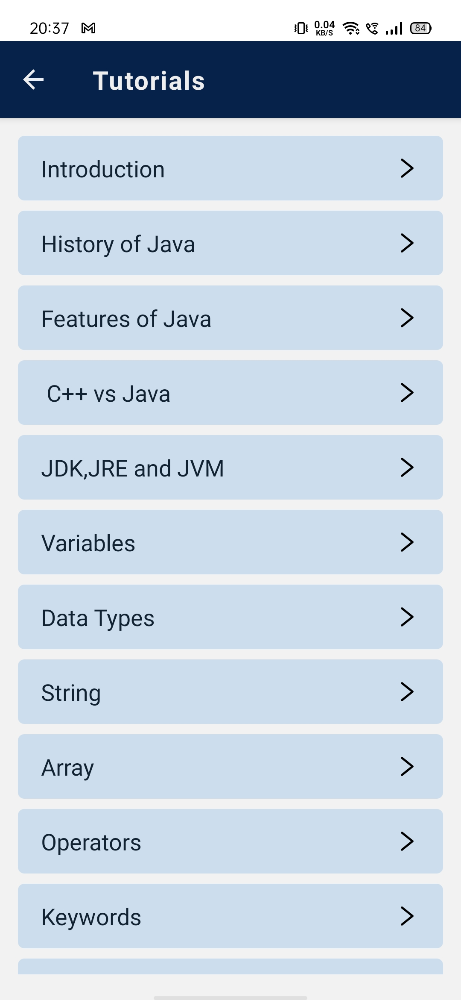
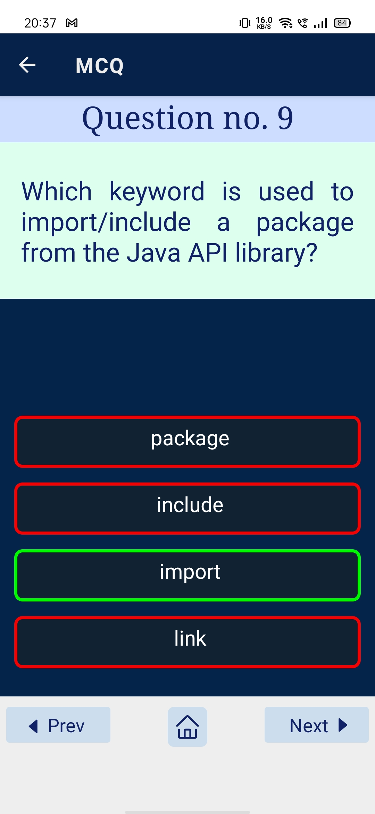

---

# CrashCode-E-Learning-App

A React Native mobile application providing comprehensive theory and practice MCQs for learning programming languages like Java, C, and C++ from beginner to intermediate levels.

---

### Project Description:
This is an E-Learning app built with React Native that provides interactive learning resources for programming languages such as Java, C, and C++. The app aims to help users learn these languages from basic to intermediate levels. It features:

- **Theory**: Detailed explanations and lessons for Java, C, and C++, covering fundamental concepts, syntax, and more advanced topics.
- **MCQs**: Multiple-choice questions for practicing and reinforcing programming knowledge.
- **User-Friendly Interface**: An intuitive and engaging design, making learning easier and enjoyable.
- **Cross-Platform Support**: Built with React Native, the app is compatible with both Android and iOS devices.

---

### Key Features:
1. **Programming Language Theory**:
   - Covers key concepts in Java, C, and C++ from the ground up.
   - Provides clear explanations, examples, and diagrams where necessary.
   
2. **MCQ Practice**:
   - Test your understanding of programming concepts with multiple-choice questions.
   - Questions are divided into categories based on difficulty (Basic, Intermediate).

3. **Responsive Design**:
   - A smooth, mobile-friendly interface that works seamlessly across Android and iOS.

4. **Progress Tracking**:
   - Keep track of your learning progress and revisit previous lessons and quizzes.

---

### Tech Stack:
- **Frontend**: React Native
- **Database**: SQLite

---

## Screenshots
  
*Home screen of the app.*

  
*Choosing Section.*

  
*Theory section for practice.*

  
*MCQ section for practice.*
---

## Video Panel
[📥 Download Demo Video :  CrashCode.mp4](https://github.com/MohammadSahil007/CrashCode-E-Learning-App/raw/main/new-folder/CrashCode.mp4)

---

## Installation

Follow these steps to set up the project locally.

### Prerequisites

Ensure you have the following installed:

- Node.js (v14.x or later)
- npm or yarn
- React Native CLI (or Expo if you are using Expo)
- Android Studio (for Android development)
- Xcode (for iOS development, if you're on macOS)

### Steps

1. Clone the repository:

   ```bash
   git clone https://github.com/MohammadSahil007/CrashCode-E-Learning-App.git
   ```

2. Navigate to the project directory:

   ```bash
   cd CrashCode-E-Learning-App
   ```

3. Install dependencies:

   ```bash
   npm install
   # or
   yarn install
   ```

4. Run the app on a simulator or device:

   - For Android:

     ```bash
     react-native run-android
     ```

   - For iOS (macOS only):

     ```bash
     react-native run-ios
     ```

---

## Usage

1. Launch the app on your Android or iOS device.
2. Choose your preferred programming language (Java, C, or C++).
3. Start reading the theory and take the quizzes for each topic.
4. Track your progress and continue learning.

---

## Contributing

Contributions are welcome! If you find any issues or want to add new features, feel free to create a pull request.

To contribute:

1. Fork the repository.
2. Create your feature branch (`git checkout -b feature-name`).
3. Commit your changes (`git commit -m 'Add feature'`).
4. Push to the branch (`git push origin feature-name`).
5. Open a pull request.

---

## License

This project is licensed under the MIT License - see the [LICENSE](LICENSE) file for details.

---

## Contact

For any questions, feel free to reach out via [ansarisahileager@gmail.com](mailto:ansarisahileager@gmail.com).

---

